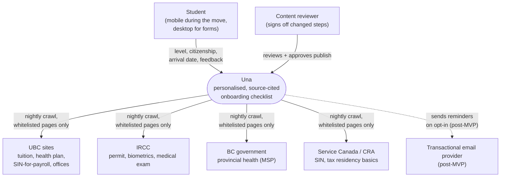
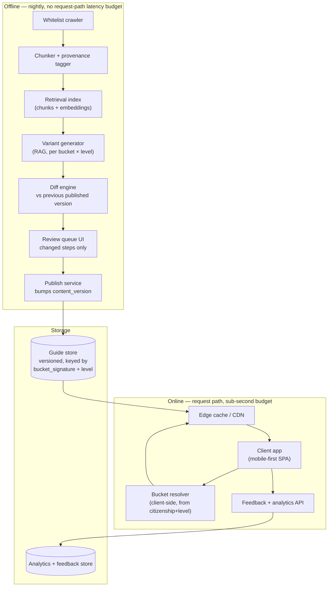
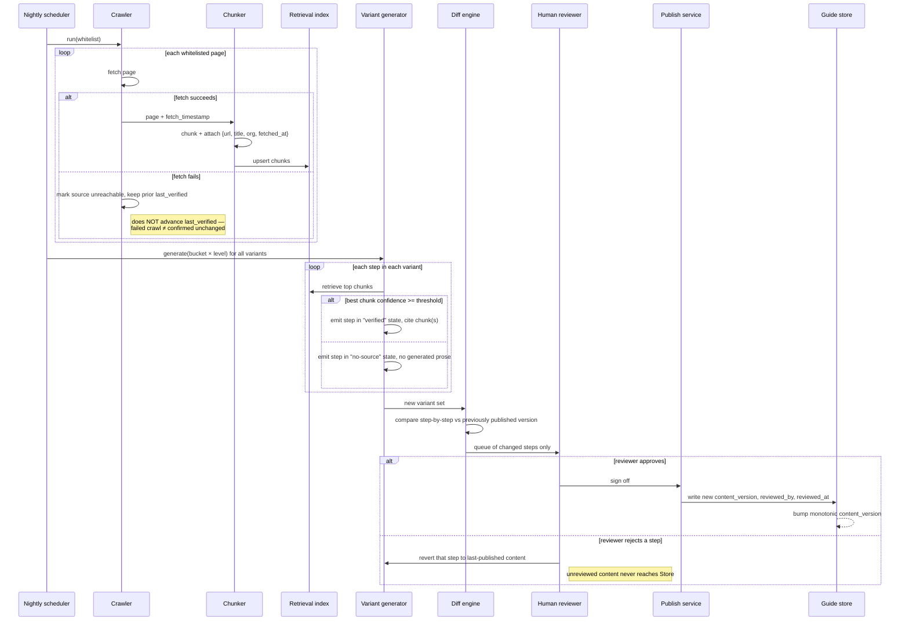
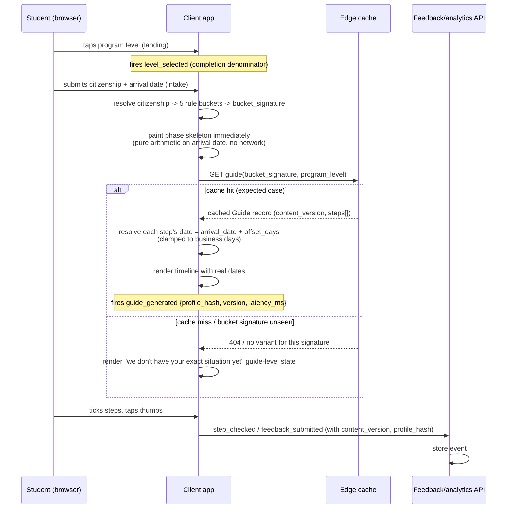
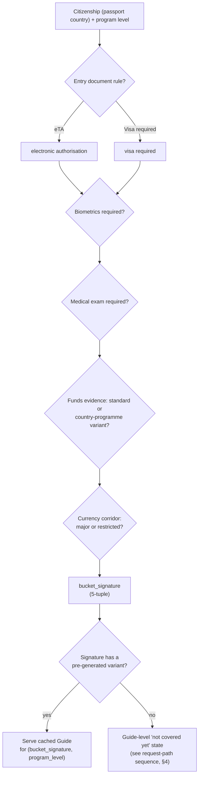
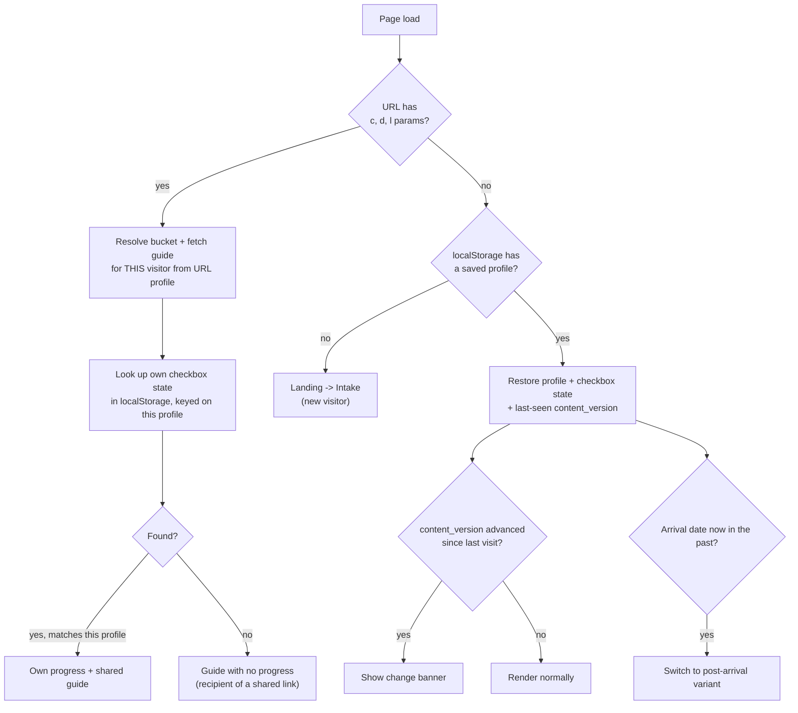
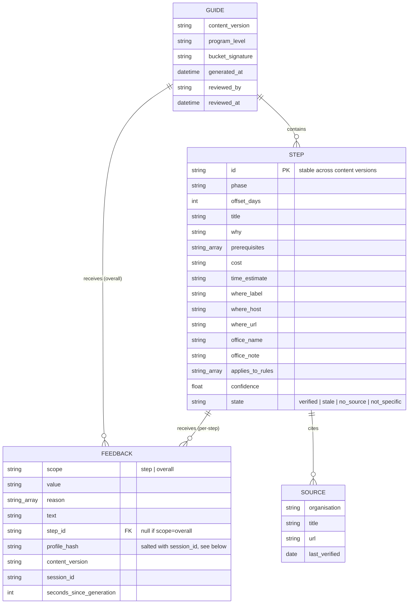
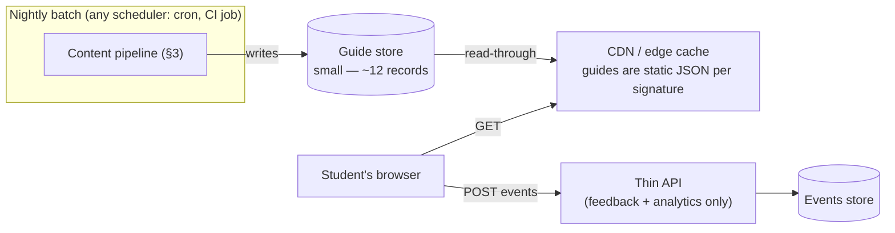

# Una — Architecture Document

Companion to `docs/prd.md`. This expands the PRD's "Architecture and content pipeline" section into a full system design: components, data flow, data model, and the operational questions the PRD leaves open (see `docs/prd-review.md` items 1–4). Nothing here overrides a PRD decision; it makes the mechanics behind those decisions concrete enough to build against.

## 1. System context

Una has two active users (the student, and the human reviewer who gates content) and four passive data sources it reads but never writes to.

Two things this diagram is meant to make obvious: the crawl direction is strictly one-way (Una reads the whitelist; nothing the four sources do reaches a user without passing through generation, diff, and human review first), and the reviewer is a first-class actor, not a background process — the architecture doesn't work without someone in that role.

## 2. Containers

The system splits cleanly along the PRD's central decision: an **offline pipeline** that runs nightly and never faces a user request, and an **online serving path** that never calls an LLM and is a cache read.

Why this split matters operationally: the offline side can be slow, can fail a crawl, can wait on a human, and none of that touches the 15-second time-to-value budget. The online side has no LLM call, no crawl, no review step — it is a lookup by `bucket_signature + program_level` against a store that was fully populated the night before. This is what makes "under 2 seconds, expected" (PRD, success metrics) an architectural guarantee rather than an optimization target.

## 3. Offline content pipeline — sequence

This expands the PRD's `W → X → Y → Z → R → P → S` diagram into what actually happens on a nightly run, including the two failure paths the PRD review flags: a step that can't clear the confidence threshold, and a crawl that fails outright.

Two mechanics worth calling out because they resolve open questions from the PRD review:

- **A failed crawl never silently advances `last_verified`.** The diagram makes that an explicit branch. This is what keeps the stale-banner threshold meaningful — "stale" always means "actually unconfirmed for N days," not "we forgot to check but assumed no news was good news."
- **The confidence threshold is evaluated per step, per variant, every run** — not once at build time. A step that was verified last week can legitimately drop to no-source this week if the underlying page changed enough that retrieval no longer clears the bar. That's a feature: it's the mechanism that keeps "no fallback to unsourced prose" true even as source pages drift.

## 4. Online request path — sequence

This is the path a student's device actually takes, from landing to a rendered guide. Nothing in this path calls an LLM.

The "cache miss / bucket signature unseen" branch is not in the PRD's flow diagrams but follows directly from PRD review item 3: with 5 binary buckets there are 32 theoretical signatures against ~6 pre-generated ones, so the online path needs a defined, designed response rather than an undefined 404. This is a guide-level state alongside the ones the PRD already specifies (arrival date in the past, well past the window, all steps done) — same family, same design bar.

Note also that `arrival_date` never appears in the cache key or in the request to the edge cache — exactly as the PRD specifies. It only enters at the last step, client-side, to turn `offset_days` into real dates. This is what lets one cached guide serve every student in a bucket, and it's the reason time-to-value can hit sub-2-second: the only per-user computation is date arithmetic in the browser.

## 5. Bucket resolution

The PRD is explicit that citizenship is not a single variable. This is the resolution logic implied by the bucket table, made explicit as a decision flow:

This resolution happens entirely client-side at intake time — it's a lookup table, not a call to the generation pipeline — which is why it can run before the cache request and doesn't count against the time-to-value budget.

## 6. Client state resolution (URL / localStorage / fresh)

The PRD specifies profile-in-URL as the mobile-to-desktop handoff and sharing mechanism, with a defined resolution order so a shared link doesn't leak the sender's progress to the recipient. As a flow:

The key correctness property, carried over directly from the PRD: checkbox state in `localStorage` must be keyed on **profile** (bucket_signature + level + arrival date), not just present unscoped — otherwise a shared link with a different profile than the recipient's own saved one would incorrectly show the sender's progress. The PRD's resolution order (URL, then localStorage, then fresh) implies this keying; making it explicit here so it isn't lost in implementation.

## 7. Data model

Two constraints from the PRD that the schema must preserve, called out because they're easy to lose in a quick implementation:

- **`STEP.id` is stable across content versions.** It's the join key for a returning user's checkbox state in `localStorage`. If a content update changes step ordering and `id` is derived from array position instead of being assigned once and kept, every returning user's ticked steps silently reassign to the wrong step. This has to be an explicit, author-assigned identifier from the moment the step schema is frozen (week 1).
- **`GUIDE` is keyed on `(bucket_signature, program_level)`, never on an individual user or on `arrival_date`.** This is the entire reason one cached record serves an unbounded number of students.
- **`FEEDBACK.profile_hash` is salted per `session_id`** (decided in `docs/decisions.md`), so it can't be matched across sessions or against the plain profile parameters in a shared URL, while `content_version`-based regression analysis still works within a session.
- **Client-side checkbox state is now three-valued** — done / not done / not applicable, keyed on `STEP.id` in `localStorage` — not the two-valued state implied by the ERD above (the ERD models published content, not per-user progress). A user marking a step "not applicable" is a signal that step's `applies_to_rules` may be wrong for that bucket; route these to the review owner's queue the same way thumbs-down reason chips do.
- **Timeline step count is capped at 20** per guide (decided in `docs/decisions.md`), up from the 16 in the current draft content.

## 8. Deployment shape (demo scale)

Not specified in the PRD in infrastructure terms; included here only to confirm the architecture doesn't need anything exotic at demo scale (~12 guides, a few hundred demo-day sessions).

At twelve guide variants, the entire Guide store fits comfortably in memory or as static JSON files behind a CDN — there is no scaling problem on the read path at this scope. The only stateful write path in the online system is the feedback/analytics API, which is low-volume and non-blocking (the guide renders whether or not an event write succeeds).

## Decisions resolved 2026-09-20

The four open items originally listed here are now decided with the product owner; full rationale in `docs/decisions.md`.

1. **Confidence threshold:** embedding similarity is the baseline signal; the review owner tunes the per-bucket cutoff after week 1's pilot bucket, rather than fixing one global number before any real content exists.
2. **Review rejection:** confirmed per-step revert, as §3's sequence diagram already assumed — only the rejected step reverts; the rest of that variant still publishes.
3. **Unmatched bucket signature:** treated as a taxonomy-coverage signal. An observed real signature outside the initial ~6 gets added to the generated set through the normal pipeline (generate → diff → review → publish), rather than permanently served from a "closest match" or "not covered" state.
4. **Crawl-failure alerting:** 3 consecutive failed crawls on the same source now alert the review owner alongside the nightly review queue.

## Decisions resolved 2026-09-24

5. **Interim behavior for an unmatched bucket signature** (the gap between a signature first being observed and the next reviewed publish that adds it, per decision 3 above): serve the nearest existing published guide for the same `program_level`, with a visible "your exact situation isn't covered yet — showing the closest match" banner at the guide level. Never render nothing.

   **Nearest-match algorithm.** Only candidates with the same `program_level` are considered (graduate/undergraduate guides aren't interchangeable — level changes the finance/health tracks). Score each candidate by comparing the 5 bucket dimensions against the target signature in priority order — `entry_document` (16) > `biometrics` (8) > `medical_exam` (4) > `funds_evidence` (2) > `currency_corridor` (1) — summing the weight for each dimension that matches; earlier dimensions are weighted higher because they gate whether whole steps exist (e.g. a biometrics step appearing or not), while the later two mostly change wording/amounts inside steps that exist either way. Highest total score wins; ties break on the lexicographically first `bucket_signature` string, for determinism. This is a client-side lookup among already-published static guides — no backend call, consistent with the online request path in §4.

   This state resolves itself automatically over time: once the taxonomy-expansion pipeline publishes the exact signature, later visits (and the pinned URL, since `bucket_signature` is derived the same way every time) pick up the real match with no client-side change needed.

## Still open

None currently.
