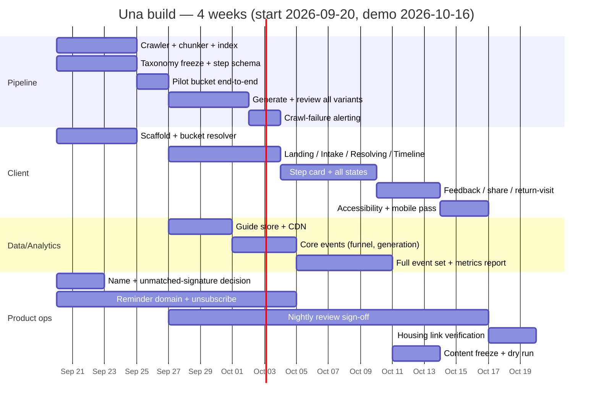

# Una — Implementation plan

Turns the PRD's 4-week plan (`docs/prd.md`, "Four-week plan and risks") and the architecture (`docs/architecture.md`) into concrete workstreams and tasks, incorporating the resolved decisions in `docs/decisions.md`. Build starts 2026-09-20; demo target 2026-10-16.

Four workstreams run in parallel, mapped directly onto the architecture's container split (`architecture.md` §2):

- **Pipeline** — the offline content pipeline (crawler → chunker → generator → diff → review → publish)
- **Client** — the online SPA (landing through return-visit)
- **Data/Analytics** — guide store, feedback API, event instrumentation
- **Product ops** — the non-engineering tasks the product owner carries personally (review sign-off, reminder infra, housing links, product name)

## Workstream owners

| Workstream | Owner | Notes |
| --- | --- | --- |
| Pipeline | Engineering | Reviewer-facing UI included here; the reviewer *using* it is Product ops |
| Client | Engineering | Mobile-first, then desktop rail |
| Data/Analytics | Engineering | Guide store schema, feedback API, event pipe |
| Product ops | Product owner (you) | Nightly review sign-off (ongoing from week 1), reminder sending domain, housing link verification, product name decision |

## Two blockers cleared before week 2 build starts

Both resolved 2026-09-24 (see `docs/decisions.md`):

1. **Product name.** Resolved: **Una**, tagline "una for uni" for now.
2. **Interim behavior for an unmatched bucket signature.** Resolved: serve the nearest existing published guide (same `program_level`, matched on bucket dimensions weighted by which ones gate whole steps vs. just wording), tagged with a visible approximate-match banner. Algorithm spec in `architecture.md`, "Decisions resolved 2026-09-24" item 5.

## Week 1 — Foundations

**Done means (PRD):** one bucket's content generated end to end and reviewed by a human.

### Pipeline
- [x] Whitelist crawler against the 4 confirmed domains (UBC, IRCC, BC, Service Canada/CRA), no crawling outward — 22 specific pages researched and product-owner signed off 2026-09-24, see `pipeline/landfall_pipeline/crawler/whitelist.py`
- [ ] Chunker: attach `{url, title, organisation, fetched_at}` to every chunk; discard any chunk without full provenance
- [ ] Retrieval index (embeddings) over chunks
- [ ] Embedding-similarity confidence scoring wired into generation (baseline mechanism per `decisions.md`; per-bucket cutoff tuning happens after this week's pilot run, not before)
- [ ] Bucket taxonomy frozen: 5 buckets (entry document, biometrics, medical exam, funds evidence, currency corridor) — no sixth added after this week
- [ ] Step schema frozen, matching `architecture.md` §7's `STEP` entity, including:
  - stable, author-assigned `id` (never array position)
  - `state` enum: `verified | stale | no_source | not_specific`
  - room for the 20-step cap (`decisions.md`) and the three-valued done/not-done/not-applicable client field (not part of this schema — that's client-side, see Client week 3)
- [ ] Diff engine: compares new variant against previously published version, step by step
- [ ] Review queue UI (minimal — changed steps only, approve/reject per step)
- [ ] Publish service: bumps monotonic `content_version`, writes `reviewed_by` / `reviewed_at`
- [ ] Crawl-failure tracking: a failed fetch does not advance `last_verified`; count consecutive failures per source
- [ ] **Pilot run:** one full bucket (crawl → chunk → generate → diff → review → publish) end to end, reviewed by the product owner

### Client
- [ ] Project scaffold, mobile-first at 390px / 16px gutter, no horizontal scroll
- [ ] Citizenship → bucket resolution table (client-side lookup, `architecture.md` §5)
- [ ] Phase-skeleton arithmetic (arrival date + offset_days → date ranges), no backend dependency

### Data/Analytics
- [ ] Guide store schema (`GUIDE` + `STEP` + `SOURCE` per `architecture.md` §7), keyed on `(bucket_signature, program_level)`
- [ ] Confirm store can be a flat/static JSON-per-signature structure behind a CDN at this scale (`architecture.md` §8) — no need for a database server

### Product ops
- [x] **Decide product name** — resolved: Una, "una for uni"
- [x] **Decide interim unmatched-signature behavior** — resolved: nearest-match + approximate-match banner (see `architecture.md`)
- [x] Sign off the week 1 pilot bucket review
- [ ] Start sourcing the reminder-email sending domain + unsubscribe mechanism (parallel track, due end of week 3)

## Week 2 — All variants, real screens

**Done means (PRD):** a graduate India profile produces a correct dated guide on a phone.

### Pipeline
- [ ] Generate and review all variants in the frozen taxonomy (the "roughly twelve" — restate as an exact count now that the taxonomy is frozen)
- [ ] Apply the per-bucket confidence cutoff tuned from week 1's pilot results
- [ ] Crawl-failure alert wired: 3 consecutive failures on a source notifies the product owner alongside the review queue

### Client
- [ ] Landing screen: consolidation headline, scope card (specific steps, not categories), housing pointer (UBC housing site + UBC Facebook roommates group, no-affiliation line), source strip with real last-checked date, program-level tap as two large targets
- [ ] Intake screen: citizenship searchable combobox (alternate-name matching), arrival-date picker with "I have not booked a flight yet" substitution + estimate flagging, privacy line, no free-text date field
- [ ] Resolving screen: phase skeleton paints immediately, status line names the actual country
- [ ] Timeline screen: profile chip with edit, pinned next-up card, progress count, phase accordions (current open, others collapsed), post-arrival variant (collapsed review strip + opens on current week)
- [ ] Guide-level "approximate match" state for an unmatched bucket signature: nearest-match lookup + banner, per the algorithm in `architecture.md`, "Decisions resolved 2026-09-24" item 5
- [ ] `guide_generated` event fires with `{profile_hash, content_version, latency_ms}`; confirm `profile_hash` is salted with `session_id` at the point of generation, not added later in week 4

### Data/Analytics
- [ ] Edge cache / CDN in front of the guide store; confirm cache-read path has no LLM call anywhere in the request lifecycle
- [ ] `level_selected` and `intake_field_abandon` events wired (funnel-start denominator + intake drop-off diagnosis)

### Product ops
- [ ] Nightly review sign-off (ongoing)
- [ ] Copy pass using the confirmed product name

## Week 3 — Step card, feedback, states

**Done means (PRD):** every state reachable in the running app, not just in the prototype.

### Client
- [ ] Step card full anatomy (`prd.md`, "Content states and the step card"): title, due date (absolute + relative), why-this-matters (tap to expand on mobile), prerequisites, cost/time estimate, where-to-do-it with visible domain, who-handles-this (including "UBC cannot help" case), source block, applies-to tag, done checkbox, thumbs
- [ ] All four step-level states built and reachable: verified, stale (amber banner), no-source (title/date/link only, no generated prose), not-specific
- [ ] Checkbox state now three-valued: done / not done / not applicable, keyed on stable `STEP.id` in `localStorage`
- [ ] Guide-level states: arrival date in the past (pre-departure collapse), well past window (say so, don't pretend), estimated date badge, generation-over-budget streaming fallback (should rarely fire given the cache-read path — treat as a defensive/cold-cache case, not a common path), all-steps-done (prompts overall rating)
- [ ] Undergraduate path in-product caveat ("this path is newer and less tested")
- [ ] Feedback: per-step thumbs always visible; overall rating card appears after first deep scroll or first checkbox tick, never on generation; thumbs-down reason chips (multi-select); thumbs-up opens WhatsApp-first share
- [ ] Return-visit resolution: URL → localStorage → fresh start order; change banner on content-version bump; countdown recomputed against today; auto-switch to post-arrival variant if arrival date has passed
- [ ] Reminder opt-in UI (build the UI regardless; gate actual sending on the product-ops sending-domain track landing in time — cut send-side only, not the opt-in capture, if it slips)

### Data/Analytics
- [ ] `step_expanded`, `step_checked`, `outbound_click`, `feedback_submitted`, `share_initiated` events wired
- [ ] "Not applicable" checkbox events routed to the same triage path as thumbs-down reason chips (signal for a wrong `applies_to_rules` tag, per `decisions.md`)

### Product ops
- [ ] Nightly review sign-off (ongoing)
- [ ] Resolve reminder-email sending domain + unsubscribe mechanism — **hard deadline this week**; if unresolved, confirm the cut applies to sending only, not the opt-in UI already built

## Week 4 — Instrumentation, accessibility, freeze, dry run

**Done means (PRD):** metrics report generates, and no critical issue from the dry run.

### Data/Analytics
- [ ] Full event set wired and verified against the table in `prd.md` ("Events to instrument"), including `reminder_opt_in` and `return_visit`
- [ ] Metrics report: helpful rate (overall thumbs-up ÷ guides generated, silent step-only raters excluded and tracked separately), completion rate (guides generated ÷ level-tap starts), time-to-value at p95
- [ ] Confirm `profile_hash` salting and `content_version` tagging on every feedback event before instrumentation is signed off

### Client
- [ ] Accessibility pass: WCAG 2.1 AA, visible keyboard focus, all interactive controls (including accordions and thumbs) keyboard-reachable, colour never the sole state carrier, screen-reader labels on icon-only buttons, reduced-motion respected
- [ ] Mobile testing on a mid-range Android device on campus wifi (not just a laptop on fibre); desktop right-rail for next-up card
- [ ] Browser matrix: current Chrome/Safari/Firefox/Edge, iOS Safari and Android Chrome one version back

### Pipeline / Product ops
- [ ] Content freeze mid-week — corrections only after this point, no additions
- [ ] Verify the two housing pointer links directly (product owner)
- [ ] Dry run with three panel members outside the original survey (per the PRD's warm-panel risk mitigation)
- [ ] Recruit the five non-survey demo participants and report their helpful rate separately from the warm panel

## Cross-cutting checklist (applies every week)

- [ ] No generated claim ships without a citation; whitelist enforced at ingestion, not generation (verify this holds after every pipeline change, not just at launch)
- [ ] Every source shows a last-checked date
- [ ] General-information disclaimer present on landing and guide footer throughout — don't let it get dropped during screen rework in weeks 2–3

## Sequencing (Gantt view)

## Dependency risks specific to this plan

| Risk | Impact if it slips | Mitigation |
| --- | --- | --- |
| Per-bucket confidence cutoff tuning (week 1 pilot → week 2 full generation) takes longer than expected | Week 2's "all twelve variants reviewed" done-criterion slips | Week 1's pilot bucket is deliberately the forcing function — if tuning isn't converged by end of week 1, escalate before starting week 2 generation rather than generating against an untuned threshold |
| Reminder sending domain unresolved by week 3 | Reminder feature cut per existing plan | Opt-in UI is built regardless (week 3); only the send-side is at risk, so the cut is cheap and doesn't touch other screens |
| Housing links go stale before the demo | Product owner disclaims but demo shows a dead/wrong link | Verify both links again during week 4 content freeze, not just once at the start |

## What this plan does not cover

Anything the PRD explicitly put out of scope (housing search/leases, course registration, jobs/clubs/transit, live human support, anything past day 30) has no workstream here either — consistent with `prd.md`'s scope table.
