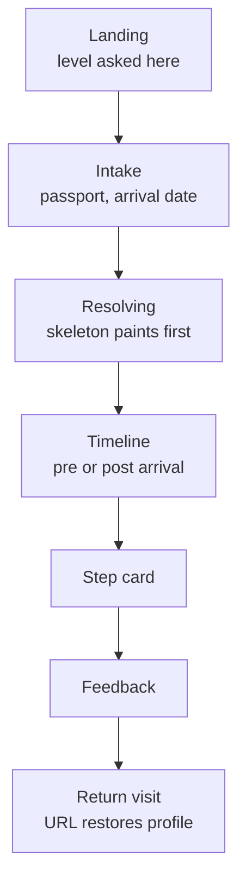
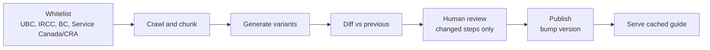

# Landfall PRD — UBC international student onboarding

Last updated 2026-09-20 · Draft for team review

Build a personalised, source-cited checklist telling an admitted UBC international student what to do and when, across immigration and money, from offer acceptance to day 30 in Vancouver. Demo target 16 October 2026.

A survey of 21 graduate students corrected two assumptions in the original brief. Students are not being misled by bad sources, they are buried by scattered ones, so the product sells consolidation and keeps citations as accuracy discipline rather than as the pitch. And the personalisation space is small enough that guides should be pre-generated and served from cache, not generated live on request.

## Problem and evidence

An admitted international student has to complete roughly twenty government and university tasks in a fixed order, on deadlines derived from a date only they know, using information published across four organisations that do not coordinate. Nothing tells them what applies to them, or when.

We surveyed 21 UBC graduate students in September 2026, all of whom started in August or September, so recall was weeks old. The results changed the framing of the product.

| Finding | Evidence | What it changes |
| --- | --- | --- |
| Scatter and volume are the pain, not deception | Spread across too many sources 38.1%, too much information 38.1%, conflicting information 0%, unsure a source was current or trustworthy 4.8% | Sell consolidation. Citations stay for accuracy and liability, not as the headline claim |
| Consolidation is the most wanted feature by a wide margin | Everything in one place 71.4%, checklist of deadlines 57.1%, direct links to sources 19%, simple explanations 9.5% | Do not spend the build writing explanatory prose |
| Difficulty has two peaks with a trough between | Preparing to move 66.7%, first two weeks 61.9%, final weeks before departure 28.6%, later in first year 0% | Timeline phases weight the two peaks. The 30 day window is confirmed |
| Reddit is not a channel for this cohort | Never used a student forum 13 of 21, never used generative AI 1 of 21, WhatsApp named four times in open text against Reddit twice | Share flows target WhatsApp. Our competitor is a general AI assistant, not a forum |
| Stress is the top reported harm | Increased stress or anxiety 28.6%, unexpected financial cost 19% | One clear next action beats a complete list |

The sample is graduate only because distribution was limited to one cohort for time. No undergraduates were reached, so the undergraduate path is untested rather than deprioritised. Respondents also skew older, with 52.4% aged 30 to 34, and all of them arrived successfully, so we are not hearing from anyone who deferred.

## Users and the job to be done

The user is an international student holding a UBC offer, at any point between accepting it and their thirtieth day in Vancouver. They have no Canadian credit history, often no local network, and a deadline structure nobody has explained to them.

> When I am preparing to move to Canada for my studies, I want one place that tells me what I have to do and when, based on my own situation, so that I can arrive without having missed something that matters.

Two profiles carry the demo.

**Graduate, the validated profile.** Older, median age band 30 to 34. Often funded through a teaching or research appointment, which makes the Social Insurance Number urgent rather than routine because payroll depends on it. Moves larger sums for tuition. Frequently arrives with dependents. Every survey finding describes this person.

**Undergraduate, the assumed profile.** Younger, more likely to have parents handling money and logistics, more likely to live in university housing, no employment dependency on a SIN. We have no data on this person. The intake keeps the undergraduate option and the content path exists, but we do not claim it is validated, and the first undergraduate responses may change it.

Access is mobile first while the move is happening and desktop when official forms are being filled, so every screen has to work at 390px and take advantage of width when it has it.

Out of consideration entirely: domestic students, exchange and visiting students on different permit rules, and anyone past their first month.

## Scope

| In scope | Out of scope | Post-MVP |
| --- | --- | --- |
| Study permits, biometrics, medical exams, port of entry | Housing search and leases | Reminders by channels other than email |
| Tuition payment, transfers, newcomer banking, credit | Course registration and academic requirements | A which-office directory across all of UBC |
| Provincial and interim health coverage, SIN | Jobs, clubs, transit, everyday life | Faculty-level content variants |
| Verified citations with a last-checked date on every step | Live human support | Integration with UBC logins |
| Feedback capture and email deadline reminders | Anything after day 30 | Undergraduate content parity once we have data |

Scope is supported by the survey where it matters. Immigration at 57.1% and tuition at 42.9% are the two in-scope areas that hurt most. Banking at 28.6% follows. Course registration at 14.3% and academic requirements at 9.5% sit low enough to leave out, despite two vivid open-text accounts about Workday and enrolment that will tempt us.

Two deliberate exceptions to a clean boundary.

**Housing gets a pointer, not a section.** It tied immigration for the hardest area at 57.1%, so saying nothing loses half the audience at the moment they scan what we cover. But housing guidance is not published on the whitelisted pages, so generating it would break the citation rule. The landing page carries a card naming two starting points and stating plainly that we do not cover it.

**Office ownership gets named on steps that have it.** Ranked low as a feature at 9.5%, but 19% did not know which UBC office to contact, and the survey's most serious account describes a student de-registered without notice and passed between three offices. Naming the owning office on a step costs a field, not a feature.

## Success metrics

Three numbers decide whether the demo worked. Each needs its denominator agreed before we instrument, because each has an ambiguous reading.

| Metric | Definition | Target |
| --- | --- | --- |
| Helpful rate | Overall thumbs up divided by guides generated. Users who rate individual steps but never rate overall are excluded from the denominator and tracked separately | 60% |
| Completion rate | Guides generated divided by intakes started, where started means the program level tap on the landing page, not a landing page view | 70% |
| Time to value | Form submission to a usable timeline on screen, measured at the 95th percentile | Under 15 seconds, expected under 2 with pre-generated variants |

Completion rate is defined from the level tap because counting a landing view as a start measures our marketing, not our form. Helpful rate excludes silent users because a person who ticks boxes and leaves has told us nothing about whether the guide was right.

Supporting signals, not targets:

- Per-step thumbs, which localise a problem the overall rating only detects
- Thumbs-down reason chips, which turn a complaint into a fix
- Outbound clicks to official sources, as a usefulness proxy independent of self-report
- Reminder opt-in rate, as a proxy for trust earned after the guide has been seen
- Step completion depth, meaning how far into the checklist people actually tick

One caution on reading any of these. Twelve of 21 survey respondents asked to trial the tool and nine left an email, so the demo panel is warm and will rate us generously. Treat the first helpful rate as a ceiling, not a baseline.

## Flow and screens

Eight screens, of which five are real screens: the profile resolution step is a loading state, and the two timeline variants share one component.

**Landing.** Headline leads on consolidation. Scope card naming specific steps, not categories. Housing pointer. Source strip with a real last-checked date from the content manifest. Program level asked inline as two large targets, so the first tap is the funnel start.

**Intake.** Two questions. Citizenship as a searchable combobox with alternate-name matching, labelled as the passport they will travel on rather than country of origin. Arrival date as a picker with a mandatory *I have not booked a flight yet* option that substitutes the term start date and flags every derived date as estimated. Privacy line stating no name, email or student number. Nineteen percent of survey respondents entered a malformed date in a free-text field, which is why this is a picker.

**Resolving.** Not a spinner. The phase skeleton with real computed date ranges paints immediately, because those are arithmetic on the arrival date and need no backend. A status line names the actual country.

**Timeline.** Profile chip with an edit affordance. A pinned *next up* card carrying the single most urgent undone step, which is the screen's answer to the job and the response to stress being the top reported harm. Progress count. Phase accordions, current phase open, others collapsed. Post-arrival variant collapses pre-departure phases into one review strip and opens on the current week.

**Step card.** Detailed in the content states section below.

**Feedback.** Per-step thumbs inline on the card, always visible. The overall rating card appears after first deep scroll or first checkbox tick, never on generation when the user has nothing to judge. Thumbs down opens multi-select reason chips. Thumbs up opens a WhatsApp-first share.

**Return visit.** Skips landing and intake. Change banner when the content version has advanced. Countdown recomputed against today. Automatic switch to the post-arrival variant if the arrival date has passed since the last visit.

The phase structure mirrors the survey's own stage wording, which is the mental model respondents already used.

| Phase | Window | Steps | Note |
| --- | --- | --- | --- |
| After your offer | Offer to T-60 | 4 | 33.3% reported difficulty here |
| Preparing to move | T-59 to T-1 | 4 | Busiest stretch, 66.7% |
| Landing day | T-0 | 1 | Permit is issued here, not before |
| Your first two weeks | T+1 to T+14 | 5 | Busiest stretch, 61.9% |
| Weeks three and four | T+15 to T+30 | 2 | 14.3% |

The two peak phases carry a visible marker. An earlier structure gave the calmest period its own section and split the busiest fortnight across two, which the survey does not support.

## Personalisation model

Three inputs. Program level, country of citizenship, arrival date. No fourth input in this build.

Citizenship is not one variable, and treating it as one is the mistake that makes this system unbuildable at 190 countries. It resolves into independent rule buckets, and content is authored against buckets rather than countries.

| Bucket | Values | Drives |
| --- | --- | --- |
| Entry document | Electronic authorisation, visa required | Pre-departure steps, processing-time warnings |
| Biometrics | Required, exempt | A dated step with a location |
| Medical exam | Required, not required | A step that must complete before departure |
| Funds evidence | Standard, country-programme variant | Finance track content |
| Currency corridor | Major, restricted | Tuition transfer guidance and lead times |

Two students from different countries may share four of five buckets and receive a near-identical guide. That is the property that keeps the variant count small.

Arrival date never enters the cache key. Steps store an integer day offset, and dates resolve client-side as arrival date plus offset, clamped to business days where a government office is involved. This is what lets one cached guide serve every student in a bucket regardless of when they fly.

Program level must produce visible differences or users will notice the question did not matter. It changes the finance and health tracks, not immigration:

- Graduate appointments need a SIN for payroll, so that step moves earlier and says why
- Graduate health plan enrolment runs through a different office than the undergraduate plan
- Funding disbursement timing differs, which changes when the first tuition transfer should start

Variant count is approximately two program levels times six realistic bucket combinations, so roughly twelve guides for the demo. That number is the whole argument for the architecture in the next section.

## Architecture and content pipeline

The guide is looked up, not generated, at request time. Retrieval-augmented generation runs nightly against the whitelist and produces the twelve variants offline. The request path is a cache read.

This is a recommendation, not a neutral description, and it is the largest technical decision in the document. Four reasons:

1. **Time to value.** A cache read is under a second. A live pipeline against a 15 second budget leaves no headroom for a slow retrieval or a rate limit on demo day.
2. **A review gate becomes affordable.** Twelve variants that change rarely can be human-reviewed before publication. We are publishing immigration and money guidance to people with real consequences on the line, and a gate between generation and publication is the difference between a mistake caught and a mistake shipped.
3. **Build risk.** Live generation is the single largest source of unknown latency and failure in a four-week build.
4. **Reproducibility.** Two students in the same bucket get the same guide, so a reported problem is reproducible rather than a one-off sample from a stochastic pipeline.

The cost is freshness. A rule that changes at 09:00 reaches users the next morning rather than immediately. Given that the underlying pages change on the order of weeks, that is an acceptable trade, and a manual pipeline trigger covers an urgent change.

**Ingestion rules.** Strictly the whitelisted domains, no crawling outward. Every chunk carries its source URL, document title, publishing organisation and fetch timestamp. A chunk without provenance is discarded rather than used.

**Generation rules.** Every generated step must cite at least one retrieved chunk above the confidence threshold. A step that cannot clear the threshold is emitted in the no-source state rather than written from the model's own knowledge. There is no fallback to unsourced prose anywhere in the system.

**Versioning.** Each publish bumps a monotonic content version. The version is stored with every feedback event and with each returning user's last-seen state, which is what makes the change banner and regression analysis possible.

If the team decides against this and keeps live RAG, the fallback behaviour in the next section becomes load-bearing rather than defensive, and the review gate disappears. That should be a conscious choice.

## Content states and the step card

The step card is the most important component in the product. Its anatomy:

- Title, verb first
- Due date, absolute and relative together, because the relative framing is what makes it feel personal
- Why this matters, one or two sentences, tap to expand on mobile
- What you need, as a short prerequisite list
- Cost and time estimate
- Where to do it, with the domain visible in the label rather than hidden behind a generic link
- Who handles this, where an office owns the step, including when the honest answer is that UBC cannot help
- Source block: organisation, document, last-checked date, direct link
- An applies-to tag stating why this step is in your guide
- Done checkbox and thumbs

The applies-to tag is cheap and does disproportionate trust work. It proves the personalisation is real rather than cosmetic, and it immediately tells a user when a step is not meant for them.

Four states, three of which are failure states we will ship. All four must be designed and built, not discovered in testing.

| State | Trigger | Renders |
| --- | --- | --- |
| Verified | Retrieval confidence above threshold, source within the recheck window | Full card as above |
| Stale | Last verified older than the recheck threshold | Full card, amber banner, source block flagged, step still shown |
| No source | Retrieval below threshold | Title, date, official link and one line saying we could not verify the specifics. No generated prose. Never a confident paragraph without a citation |
| Not specific | Step exists but is not country or level specific | Full card with a tag saying so plainly, rather than implying personalisation that is not there |

Additional states at the guide level:

- **Arrival date in the past.** Pre-departure phases collapse into a review strip, view opens on the current phase.
- **Arrival date well past the window.** Beyond roughly six weeks after arrival we are outside our stated coverage. Say so rather than rendering a guide that pretends otherwise.
- **Estimated date.** Every derived deadline carries a visible estimate badge until the user supplies a real date.
- **Generation over budget.** Stream the deterministic skeleton immediately and fill citations progressively rather than blocking the screen.
- **All steps done.** Needs a designed state, and it is the best moment in the product to ask for the overall rating.

## Data model and analytics

**Step record.** Each step in a published guide carries: `id`, `phase`, `offset_days`, `title`, `why`, `prerequisites[]`, `cost`, `time_estimate`, `where{label, host, url}`, `office{name, note}` where applicable, `sources[]` each with organisation, title, url and last_verified, `applies_to_rules[]`, `confidence`, and `state`.

The `id` must be stable across content versions. Checkbox state is keyed on it, so keying on array position means a content update silently unticks the wrong steps for every returning user.

**Guide record.** `content_version`, `program_level`, `bucket_signature`, `steps[]`, `generated_at`, `reviewed_by`, `reviewed_at`.

**Client state.** Profile lives in the URL, for example `/guide?c=IN&d=2026-08-25&l=grad`. This solves mobile-to-desktop handoff without authentication and makes guides shareable, which is our only distribution mechanism inside four weeks. Checkbox state and last-seen content version live in local storage on top. Resolution order is URL, then local storage, then a fresh start, so a shared link always builds the recipient their own guide rather than handing them the sender's progress.

**Feedback payload.** `scope` (step or overall), `value`, `reason[]`, `text`, `step_id`, `profile_hash`, `content_version`, `session_id`, `seconds_since_generation`.

Carrying `content_version` on every feedback event is what lets us tell whether a drop in helpful rate came from a content update or from the audience.

**Events to instrument.**

| Event | Carries | Answers |
| --- | --- | --- |
| `landing_view` | referrer | Traffic source |
| `level_selected` | level | Funnel start, the completion denominator |
| `intake_field_abandon` | field | Whether we lose people on country or on date |
| `guide_generated` | profile hash, version, latency ms | Time to value, completion numerator |
| `step_expanded` | step id, state | Which steps get read, which states get skipped |
| `step_checked` | step id | Completion depth |
| `outbound_click` | step id, host | Usefulness independent of self-report |
| `feedback_submitted` | full payload above | Helpful rate |
| `reminder_opt_in` | none | Trust earned after the guide |
| `share_initiated` | channel | Whether the WhatsApp bet was right |
| `return_visit` | days since last, version delta | Retention and change-banner value |

No third-party analytics, so no consent banner on first paint. Events go to our own endpoint keyed on the anonymous session id.

## Non-functional requirements

**Performance.** Timeline usable within 15 seconds at p95, expected under 2 with cached variants. Phase skeleton with real dates in the first paint. No per-step network calls once the guide has loaded. Build for a mid-range Android phone on campus wifi, not a laptop on fibre.

**Privacy.** No account, no name, email or student number required to generate a guide. Email is collected only after the guide exists, only for deadline reminders, and only with an explicit opt-in. No third-party analytics. The privacy line on the intake screen is a product claim we have to keep, not marketing.

**Accessibility.** WCAG 2.1 AA. Visible keyboard focus throughout. Every interactive control reachable by keyboard, including the phase accordions and thumbs. Colour is never the sole carrier of state: a stale step says stale in words as well as in amber. Screen-reader labels on icon-only buttons. Respect reduced-motion.

**Responsive.** Mobile first at 390px with a 16px gutter and no horizontal scroll. Desktop gains a right rail for the next-up card. Both tested, since the survey cohort moves between phone during the move and desktop for forms.

**Browser support.** Current Chrome, Safari, Firefox and Edge, plus iOS Safari and Android Chrome one version back. No native app.

**Content integrity.** No generated claim ships without a citation. Every source carries a last-checked date visible to the user. Whitelist is enforced at ingestion, not at generation.

**Legal posture.** A general-information disclaimer on the landing page and in the footer of every guide. The product does not give immigration or financial advice and says so. Nothing in the copy should read as a guarantee of an outcome, particularly around permit approval.

## Four-week plan and risks

Weeks are counted from the start of build, against a demo target of 16 October 2026. Adjust if that date is wrong.

| Week | Ships | Done means |
| --- | --- | --- |
| 1 | Whitelist crawler, chunking with provenance, bucket taxonomy agreed, step schema frozen | One bucket's content generated end to end and reviewed by a human |
| 2 | All twelve variants generated and reviewed. Landing, intake, resolution, timeline built against real content | A graduate India profile produces a correct dated guide on a phone |
| 3 | Step card with all four states. Feedback capture. Share. Reminders opt-in. Return-visit resolution and change banner | Every state reachable in the running app, not just in the prototype |
| 4 | Analytics wired, accessibility pass, mobile testing, content freeze, dry run with three panel members | Metrics report generates, and no critical issue from the dry run |

Content freeze lands mid-week 4. After it, only corrections, not additions.

**Risks.**

| Risk | Likelihood | Impact | Mitigation |
| --- | --- | --- | --- |
| Content generation takes longer than a week per pass | High | High | Start week 1 with one bucket end to end. If the pipeline slips, hand-author the twelve variants against the same schema and keep the citation rule |
| Bucket taxonomy proves wrong mid-build | Medium | High | Freeze the taxonomy at the end of week 1. Changing it later invalidates every generated variant |
| A published step is materially wrong | Medium | Severe | The human review gate exists for this. It is the mitigation, which is why the architecture is built around affording it |
| Demo panel is too warm to be informative | High | Medium | Recruit five people outside the survey. Report their helpful rate separately |
| Housing questions dominate feedback | Medium | Low | The landing pointer sets expectations. Track it in the reason chips |
| Scope creep into academics | Medium | High | The decision is recorded above. Reopening it needs new quantitative evidence, not another anecdote |
| Undergraduate content ships untested | Certain | Medium | Say so internally. Do not present undergraduate output as validated at the demo |

## Open decisions

Each of these needs a human answer before the relevant week starts. They are ordered by when they block.

Resolved 2026-09-20 with the product owner — see `docs/decisions.md` for full rationale on each.

- [x] **Confirm the demo date.** Kept at 16 October 2026. Build starts today (20 September 2026), about 2 days tighter than the nominal 4-week plan.
- [x] **Approve the pre-generated architecture.** Approved as written. Live generation stays a post-MVP option, not revisited for this build.
- [x] **Name the review owner.** Product owner is the review owner and also receives crawl-failure alerts.
- [x] **Freeze the bucket taxonomy.** Five buckets stand. Coverage of signatures outside the initial ~6 generated variants is handled by expanding the generated set through the normal pipeline, not by reopening the taxonomy (see `docs/decisions.md`).
- [ ] **Decide the product name.** Landfall remains a placeholder. Still open — blocks week 2 copy.
- [x] **Set the recheck window.** 30 days for immigration, 90 for the rest, as suggested.
- [x] **Confirm the metric denominators.** Level tap as the completion start; silent users excluded from helpful rate (tracked separately).
- [x] **Decide on a not-applicable state.** Adding it. Steps get done / not done / not applicable.
- [x] **Cap the step count.** 20 steps.
- [x] **Agree who sends reminder emails.** Product owner owns the sending domain and unsubscribe mechanism. Cut the feature if not ready by week 3, per the existing plan.

Two things are decided and should not be reopened without new evidence. Academics stay out of scope, on the strength of 14.3% and 9.5% against two open-text accounts. The undergraduate and graduate split stays in, because reaching no undergraduates was a limit of distribution rather than a finding about need.
